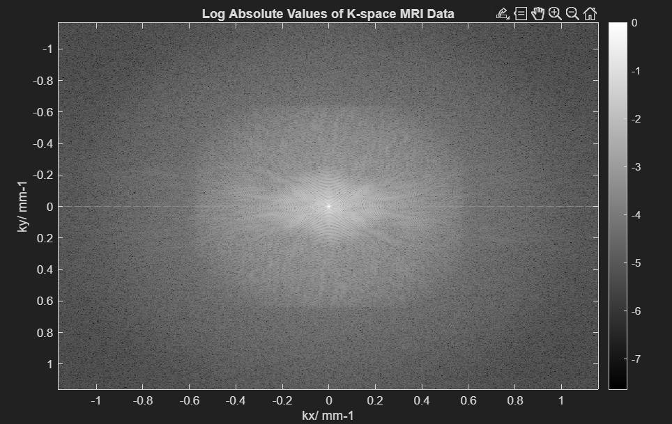
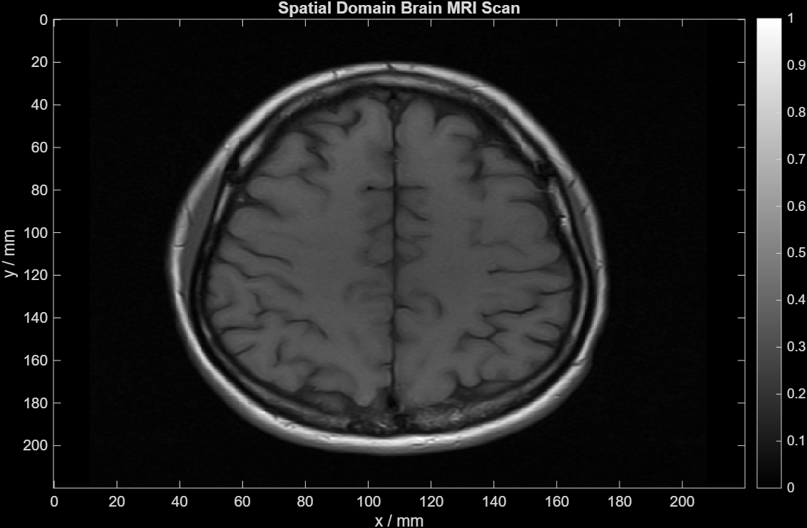
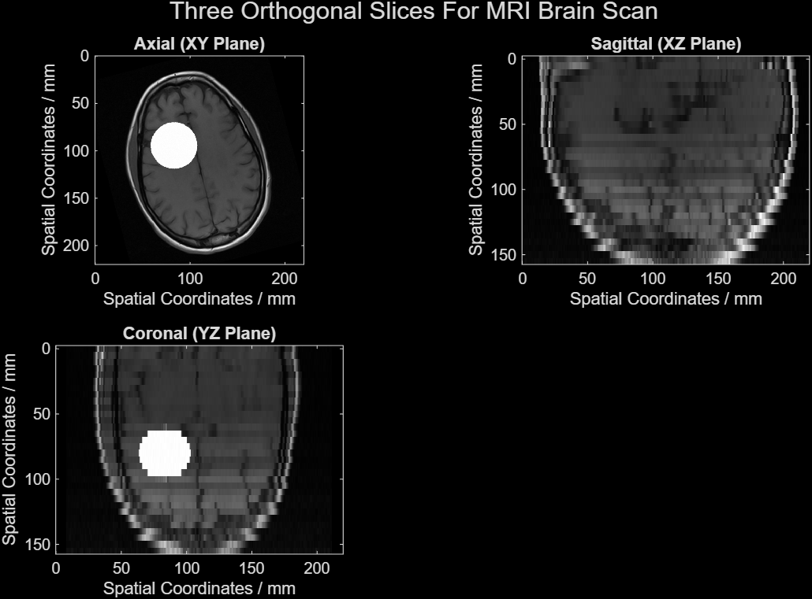
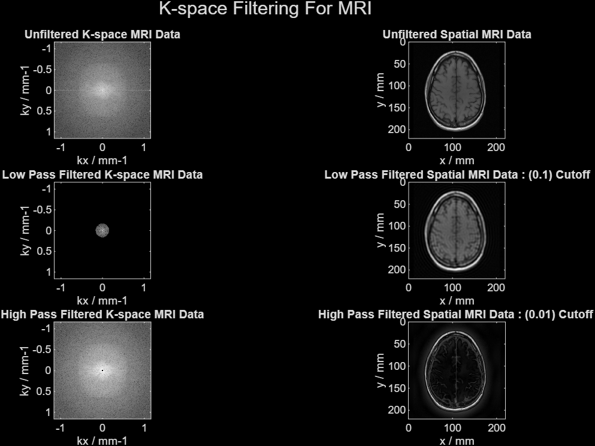
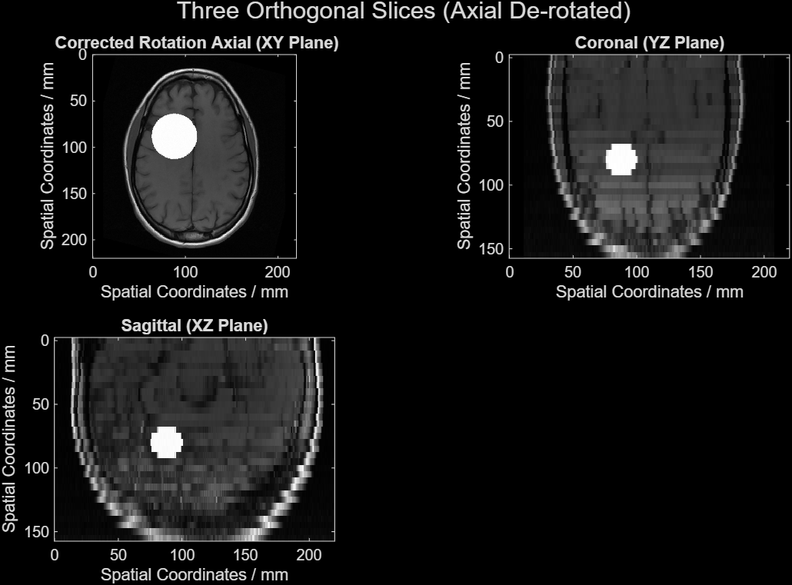
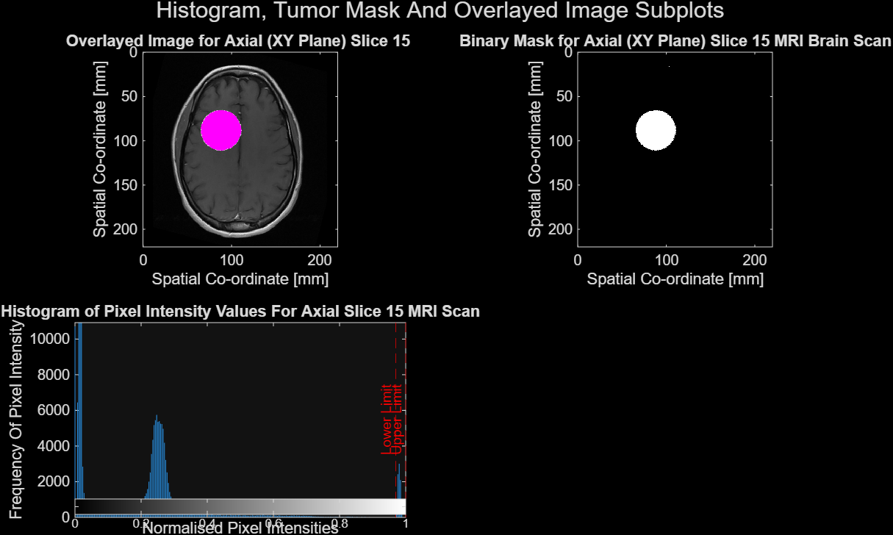
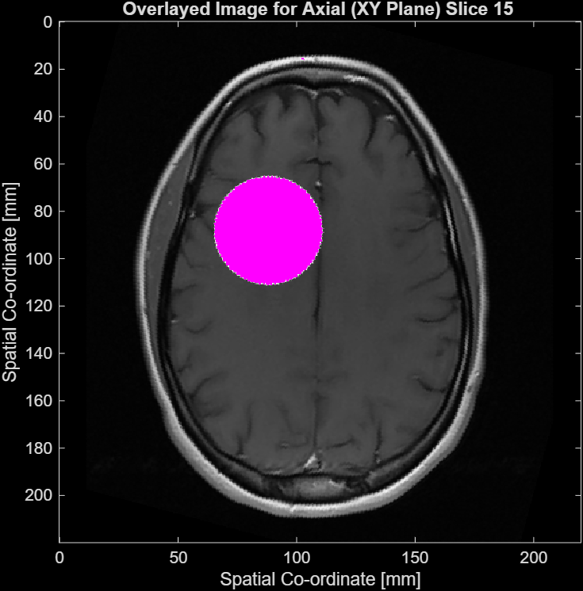
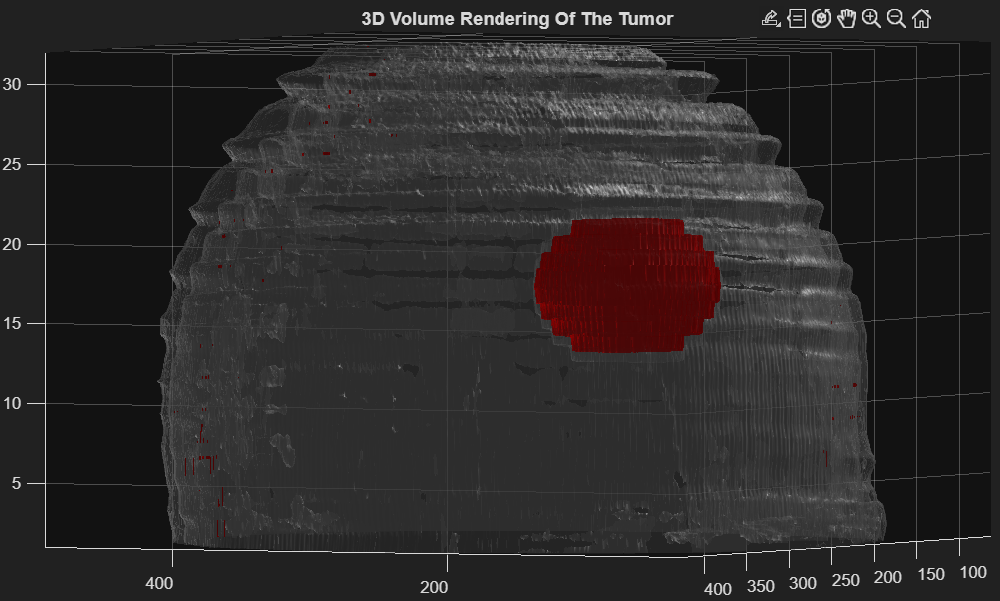

# MRI Reconstruction and Segmentation Pipeline (MATLAB)

### 3D Tumour Rotation (Animated)

I developed a complete MRI processing pipeline in MATLAB, starting from raw k‑space data to the full 2D and 3D spatial brain MRI images. 
This included 2D inverse Fourier reconstruction of a single slice, circular low‑pass and high‑pass k‑space filtering, 3D inverse FFT of a volumetric head dataset, rotation correction of misaligned slices, intensity‑based tumour segmentation on a single slice and the full 3D volume (Dice coefficient against ground truth), and 3D visualisation of the segmented tumour using volume rendering. 

I learnt the core concepts in MRI image reconstruction, general medical image processing, applied Fourier transforms from my physics courses, and binary segmentation.

## Results

### K-space Visualisation (Log Scale)

### Spatial Domain Reconstruction

### Multi-Plane Reconstruction (Sagittal, Coronal, Axial)

### Frequency Filtering (Low-pass vs High-pass)

### Rotation Correction

### Tumour Segmentation (Mask + Overlay)

### Overlayed MRI Slice

### 3D Tumour Visualisation

